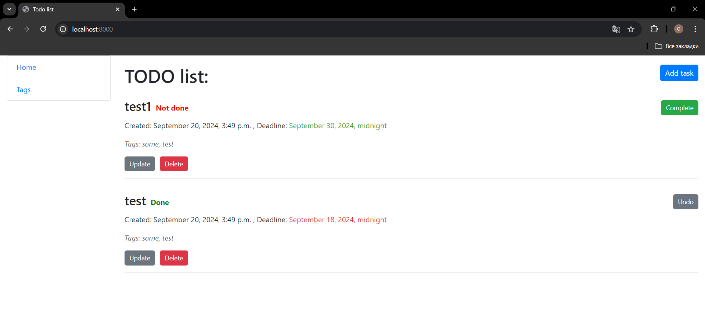
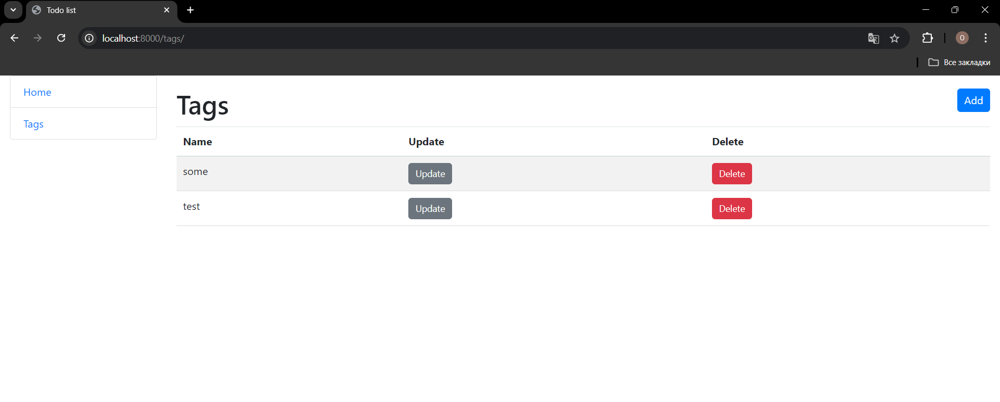

# TODO List Django Application

This is a Django-based TODO list application where users can create, update, delete, and toggle the completion status of tasks. The app is designed with a user-friendly interface and supports adding tags to tasks, as well as managing task deadlines.

## Features

- **Create Tasks**: Add new tasks to the TODO list with optional deadlines and tags.
- **View Tasks**: See all tasks in the list, with each task showing its creation date, status (done or not done), and any associated tags.
- **Update Tasks**: Edit the content, tags, or deadlines of existing tasks.
- **Delete Tasks**: Remove tasks from the list.
- **Toggle Task Status**: Mark tasks as "done" or "not done" by clicking a button.
- **Ordering**: Tasks are displayed in the order of their completion status.

## Technologies Used

- **Django**: Web framework used to build the backend of the application.
- **HTML/CSS**: Used for the frontend, providing a simple and responsive user interface.
- **Bootstrap**: Frontend framework for styling and layout.
- **SQLite**: The default database used for local development.

## Installation

### 1. Clone the repository:
   ```bash
   git clone https:https://github.com/GGsosna/todo-list.git
   cd todo-list-django
   ```

### 2. Create a virtual environment:

- **For Windows:**

    ```bash
    python -m venv venv
    venv\Scripts\activate
    ```

- **For macOS/Linux:**

    ```bash
    python3 -m venv venv
    source venv/bin/activate
    ```

### 3. Install dependencies:

Run the following command to install all required packages:

```bash
pip install -r requirements.txt
```

### 5. Apply database migrations:

Run the migrations to initialize the database:

```bash
python manage.py migrate
```

### 6. Run the development server:

Once the database is set up, run the development server:

```bash
python manage.py runserver
```

## Usage

After starting the server, go to [http://127.0.0.1:8000](http://127.0.0.1:8000) in your browser.

## Demo

Home page:


Tags:

